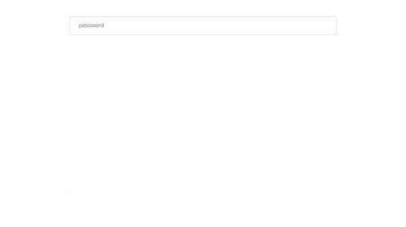

# ReactJS - Password Input

ReactJS based Password component to add password as a text/password property with validation. The password value is automatically validated on blur event. You can also disable and hide password field using disable and hide props.

## Table of contents

- [Browser Support](#browser-support)
- [Demo](#demo)
- [Getting started](#getting-started)
- [Usage](#usage)
- [Available Props](#available-props)
- [Methods](#methods)
- [Want to Contribute?](#want-to-contribute)
- [Collection of Components](#collection-of-components)
- [Changelog](#changelog)
- [License](#license)
- [Keywords](#Keywords)

## Browser Support

|  |  |  |  |  |
| ---------------------------------------------------------------------------------------- | ------------------------------------------------------------------------------------------- | ---------------------------------------------------------------------------------------- | ---------------------------------------------------------------------------------- | ---------------------------------------------------------------------------------------------------------------------------- |
| 83.0 ✔                                                                                   | 77.0 ✔                                                                                      | 13.1.1 ✔                                                                                 | 83.0 ✔                                                                             | 11.9 ✔                                                                                                                       |

## Demo

[](https://github.com/weblineindia/ReactJS-Password-Input/password.gif)

## Getting started

Install the npm package:

```bash
npm install react-weblineindia-password
#OR
yarn add react-weblineindia-password
```

## Usage

Use the `<react-weblineindia-password>` component:

```js
import React ,{ Component } from 'react';
import Password from 'react-weblineindia-password'

class Test extends Component {
    constructor(props) {
    super(props);
    this.state = {
      vData: "",
      isShowPassword:false
    };
    // This method is used for handle password input value
    onChange(event){
      this.setState({
        vData : event.target.value
      })
    }
    render(){
    return (
      <div>
        <Password
         id="password"
         name="password"
          value ={this.state.vData}
          onChange={this.onChange}
          placeholder ="Password"
          isViewPassword={this.state.isShowPassword}
          onChange={this.onChange.bind(this)}
        />
      </div>
    )}
}
```

## Available Props

| Prop             | Type    | default                                          | Description                      |
| ---------------- | ------- | ------------------------------------------------ | -------------------------------- |
| maxlength        | Number  | 255                                              | max length for password          |
| passwordErrorMsg | String  | The password field must be at least 3 characters | error Msg for password           |
| placeholder      | String  | password                                         | password placeholder             |
| disabled         | Boolean | false                                            | disable password field           |
| name             | String  | password                                         | name for password field          |
| tabindex         | Number  | 1                                                | password tabIndex                |
| id               | String  | password                                         | name for password field          |
| hide             | Boolean | false                                            | for hide password field          |
| isViewPassword   | Boolean | true                                             | To hide/show eye icon            |
| value            | String  |                                                  | value for password               |
| hide             | Boolean | false                                            | for hide password field          |
| passwordMinValue | Number  | 3                                                | For password field minimum value |
| classname        | object  |                                                  | Class to the input               |

## Methods

| Name       | Description                                                      |
| ---------- | ---------------------------------------------------------------- |
| onFocus    | Gets triggered when the autocomplete input field receives focus. |
| onBlur     | Gets triggered when the autocomplete input field loses focus.    |
| onChange   | Gets triggered when the autocomplete results got changed.        |
| onKeypress | Gets triggered when a key gets pressed.                          |
| onKeyDown  | Gets triggered when a key gets down.                             |
| onKeyUp    | Gets triggered when a key gets up.                               |

## Want to Contribute?

- Created something awesome, made this code better, added some functionality, or whatever (this is the hardest part).
- [Fork it](http://help.github.com/forking/).
- Create new branch to contribute your changes.
- Commit all your changes to your branch.
- Submit a [pull request](http://help.github.com/pull-requests/).

---

## Collection of Components

We have built many other components and free resources for software development in various programming languages. Kindly click here to view our [Free Resources for Software Development](https://www.weblineindia.com/software-development-resources.html)

---

## Changelog

Detailed changes for each release are documented in [CHANGELOG.md](./CHANGELOG.md).

## License

[MIT](LICENSE)

[mit]: https://github.com/weblineindia/ReactJS-Password-Input/blob/master/LICENSE

## Keywords

react-weblineindia-password, password-input, reactjs-password, react-password-input, react-password, react-input-field, input-field
